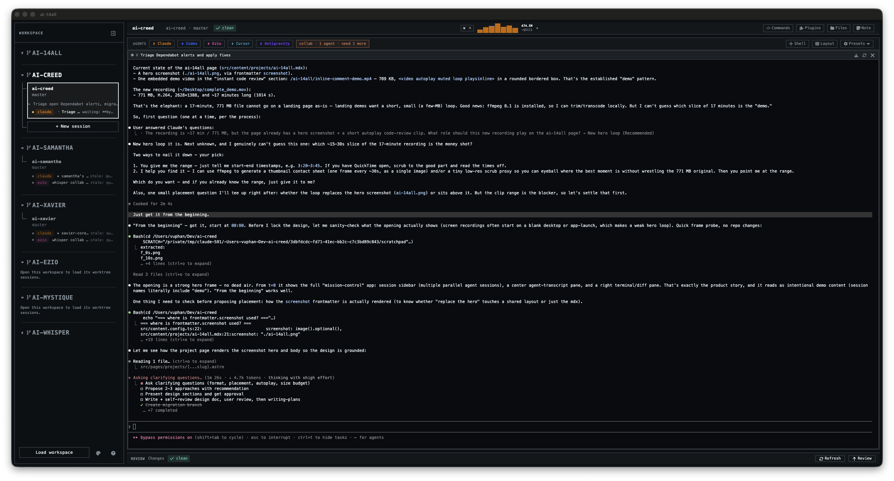

# ai-14all

[](./LICENSE)
[](https://github.com/ai-creed/ai-14all/releases)
[](#install)

ai-14all is a mission-control desktop app for running AI coding agents in parallel across Git worktrees. Every session is pinned to its own worktree, branch, and terminal, so you can fan a task out to Claude, Codex, and more at once — each isolated in its own checkout — see at a glance which agent needs you, and review their diffs inline without leaving for a full IDE.

## Magic moment

Open a repository and spin up a session. ai-14all creates a fresh Git worktree, pins the session to it, and drops you into a terminal that lives in that checkout:

```text
New session → names a branch, creates the worktree, opens a shell pinned to it
```

Launch a coding agent in that terminal and let it work:

```bash
claude     # or: codex, or any agent CLI
```

Then create a second session for a second task — a second agent, its own worktree and branch, fully isolated from the first. Fan out across as many as you need. From there the window does the rest:

- **Session-per-worktree isolation** — each agent gets its own branch and working tree, so parallel agents never step on each other's files.
- **Agent attention model** — the sidebar tracks every agent's state (working, waiting on you, done, failed) and rolls it up per session, so fanning out across five agents never loses track of who needs what. Agents can report their own status and current task over a built-in MCP server.
- **Terminal-first** — real PTY shells (signed and working under the macOS hardened runtime), a slot-based multi-terminal layout, find-in-terminal, and theme-aware rendering.
- **Lightweight review in-window** — inspect changed files, author inline diff comments, and walk commit history on demand, then keep or discard the agent's work — no separate IDE.
- **Token telemetry** — per-agent token usage for Claude and Codex, surfaced live.

## Visual proof

A live session view: the worktree rail and per-agent attention on the left, the
terminal-first main column, and on-demand review without leaving the window.
Click the still to learn more on the project page.

[](https://ai-creed.dev/projects/ai-14all/)

## Who this is for

ai-14all is for engineers who already run coding agents and want to run several at once with structure around them:

- you fan work out to multiple agents and want each isolated in its own Git worktree and branch.
- you work terminal-first and want agents living in real shells, not a web UI.
- you want to see, at a glance, which agent is working, which is blocked on you, and which is done.
- you want quick diff review in the same window — not a context switch into a full IDE.

It is **not** for:

- single-agent, one-off prompting — just run the agent CLI directly.
- a full IDE replacement — ai-14all orchestrates and reviews; it doesn't try to be your editor.
- Intel Macs or Windows — Apple Silicon (arm64) only today.

## Install

macOS on Apple Silicon. Download the latest signed, notarized DMG from the [releases page](https://github.com/ai-creed/ai-14all/releases/latest), drag the app into `/Applications`, and open it — no Gatekeeper workaround needed.

The app checks for updates on launch. When a newer stable version is published it **downloads in the background** and prompts you to **Restart now / Later** — choosing Later installs it on your next quit.

### Optional: verify the download

The release manifest at [ai-creed.dev/ai-14all/latest-mac.yml](https://ai-creed.dev/ai-14all/latest-mac.yml) lists the sha512 of every shipped artifact. Compare it against your local download:

```sh
shasum -a 512 ai-14all-*-arm64.dmg | awk '{print $1}' | xxd -r -p | base64
```

This produces the same base64-encoded digest that appears in `latest-mac.yml` under the matching `files[].sha512` field. If they differ, the download is corrupt or tampered.

## Build from source

Node.js 24+ and pnpm.

```sh
pnpm install
pnpm dev
```

To produce a local unsigned package, run `pnpm package:mac`. Producing a signed + notarized build (and the CI release pipeline) is documented in the [signing runbook](./docs/signing-runbook.md).

## Core concepts

ai-14all is **supervised parallelism, not a swarm**. Each session is a real Git worktree with a real terminal; those terminals are the source of truth, and the agents run as ordinary CLIs inside them. The app's job is to keep many of them straight at once — isolating their checkouts, surfacing which one needs your attention, and giving you a fast path to review and accept their work. You stay the gatekeeper: nothing merges or ships without you.

Claude and Codex are detected and badged today; any agent CLI runs in a session.

## Learn more

- [Changelog](./CHANGELOG.md) — release-by-release history.
- [Known issues](./KNOWN-ISSUES.md) — current limitations and workarounds.
- [Signing runbook](./docs/signing-runbook.md) — how signed/notarized builds are produced, locally and in CI.
- [Project page](https://ai-creed.dev/projects/ai-14all/) — overview and demo.

## Workspace commands

```bash
pnpm install
pnpm dev          # run the app in development
pnpm test         # unit tests (vitest)
pnpm test:e2e     # end-to-end tests (Playwright)
pnpm typecheck
pnpm lint
pnpm format
pnpm package:mac  # local unsigned macOS build
```

## Contributing

Contributions are welcome. Because ai-14all may offer commercial editions, every
contributor must agree to the [Contributor License Agreement](./CLA.md) before
their first contribution is merged — it lets the project relicense your work
(including under future commercial terms) while you retain copyright to it.

## License

[Functional Source License 1.1, Apache 2.0 Future License](./LICENSE)
(`FSL-1.1-ALv2`).

You may use, copy, modify, and redistribute ai-14all for any purpose **except a
Competing Use** — broadly, making it (or substantially similar functionality)
available to others in a commercial product or service that competes with
ai-14all. Internal use, non-commercial education, and non-commercial research
are always permitted. Two years after each version is released, that version
automatically converts to the Apache License 2.0.

FSL is **source-available**, not an OSI-approved "open source" license. See
[fsl.software](https://fsl.software) for the rationale and FAQ.
